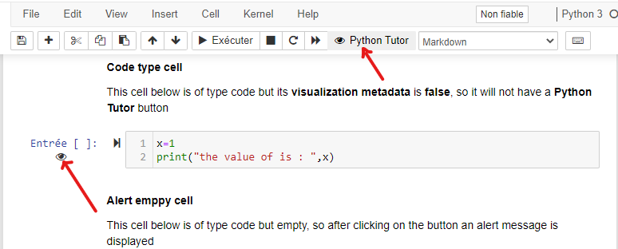

## Read the documentatoin
[](https://github.com/kandjiabdou/visual_pytutor/wiki)
# Python Tutor Visualization
The goal of this jupyter extension is to make it easy to view on pythontutor the code of each cell of a jupyter notebook.
The jupyter software is used for teaching the basics of programming to IT departments (Module M1102 and M1103) and STID. In these modules, we also use the pythontutor site for step-by-step visualization of code execution.



### Installation
Install and activate visual pytutor on your Jupyter server.

Go to the jupyter nbextensions directory.

Example of path "C:/Users/\[username]/anaconda3/share/jupyter/nbextensions"
```
git clone https://github.com/kandjiabdou/visual_pytutor.git
jupyter nbextension install visual_pytutor
jupyter nbextension enable visual_pytutor/main
```

### Examples
See [EXAMPLE](https://github.com/kandjiabdou/visual_pytutor/tree/master/Exemple) for the guide and examples.

### Installation Jupyter Nbextensions Configurator
For those using conda, you can now get jupyter_nbextensions_configurator from the excellent conda-forge channel in a single command:

```
conda install -c conda-forge jupyter_nbextensions_configurator
```

For those not using conda, the installation has two steps:

1. Installing the pip package. This should be as simple as
```
pip install jupyter_nbextensions_configurator
```
2. Configuring the notebook server to load the server extension. A jupyter subcommand is provided for this. You can enable the serverextension and the configurator nbextensions listed below for the current user with
```
jupyter nbextensions_configurator enable --user
```
Once installed, you'll need to restart the notebook server. Once restarted, you should be able to find the configurator user interfaces as described below.